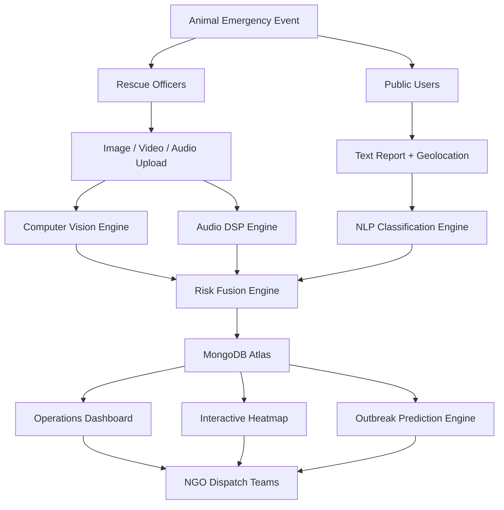

# 🚨 Problem Statement

Millions of stray and wild animals suffer from injuries, road accidents, abuse, disease outbreaks, starvation, and environmental hazards every year. Unfortunately, rescue operations often rely on manual reporting, delayed assessments, and fragmented communication between citizens, NGOs, and rescue teams.

Current challenges include:

- Lack of real-time animal distress monitoring.
- Delayed rescue response due to manual verification.
- No centralized platform for tracking incidents.
- Difficulty assessing injury severity remotely.
- Limited visibility into animal welfare hotspots.
- Absence of predictive systems for animal distress outbreaks.

As a result, many animals do not receive timely medical attention, reducing their chances of survival and recovery.

---

# 💡 Proposed Solution

AnimAI: Guardian Network is an AI-powered multi-modal animal emergency intelligence platform that automatically detects, assesses, monitors, and prioritizes animal rescue cases using visual, acoustic, and geolocation data.

The platform enables both citizens and rescue officers to report incidents while AI models analyze uploaded images, videos, and audio recordings to determine:

- Injury severity
- Distress levels
- Behavioral abnormalities
- Risk scores
- Rescue priority levels

The system then visualizes incidents on a live dashboard, generates severity heatmaps, predicts future distress hotspots, and assists NGOs and rescue teams in making faster and more informed rescue decisions.

---

# 🛠️ Technology Stack

## Frontend

- React 18
- Vite
- Tailwind CSS
- Framer Motion
- React Leaflet
- Three.js
- React Three Fiber

## Backend

- FastAPI
- Uvicorn
- Python

## Artificial Intelligence

### Computer Vision

- YOLO11
- OpenCV

### Audio Intelligence

- Librosa
- NumPy

### Natural Language Processing

- Rule-Based NLP Classification

## Database & Storage

- MongoDB Atlas
- Motor (Async MongoDB Driver)
- Cloudinary

## Mapping & Geolocation

- Leaflet
- OpenStreetMap
- Browser Geolocation API

## Deployment

- Vercel
- Render

---

# 🏗️ System Architecture

---

# ✨ Key Features

## 🧠 AI-Powered Injury Detection

Detects:

- Open wounds
- Visible trauma
- Posture abnormalities
- Aggressive behavior
- Fatigue indicators

using computer vision algorithms.

---

## 🎙️ Acoustic Distress Analysis

Analyzes animal vocalizations to identify:

- Pain
- Fear
- Aggression
- Fatigue
- Calm behavior

and estimates distress probability.

---

## 📍 Interactive Rescue Heatmap

Provides:

- Real-time incident visualization
- Severity-based clustering
- Regional distress monitoring
- Geographical hotspot identification

---

## 🚨 Intelligent Risk Scoring

Combines visual and acoustic intelligence into a unified:

- Risk Score
- Severity Level
- Rescue Priority

for better decision-making.

---

## 🌐 Community Reporting Platform

Allows citizens to:

- Report injured animals
- Upload evidence
- Share location details
- Alert rescue organizations instantly

---

## 📊 Operations Dashboard

Centralized command center for:

- Active incidents
- Rescue history
- Live metrics
- Dispatch management
- Incident tracking

---

## 🔮 Outbreak Prediction Engine

Uses historical incident patterns to:

- Predict distress hotspots
- Forecast rescue demand
- Support proactive interventions

---

## ☁️ Cloud-Based Infrastructure

Provides:

- Secure media storage
- Centralized data management
- High scalability
- Global accessibility

---

# 🔄 Workflow

## Step 1: Incident Occurs

An injured or distressed animal is spotted by a citizen or rescue officer.

↓

## Step 2: Data Submission

Users upload:

- Images
- Videos
- Audio clips

or submit a text report with geolocation.

↓

## Step 3: AI Processing

The system processes the uploaded data using:

- YOLO11 Object Detection
- OpenCV Image Analysis
- Librosa Audio Processing
- NLP Classification

↓

## Step 4: Risk Assessment

A multi-modal fusion engine calculates:

- Distress Probability
- Injury Severity
- Final Risk Score
- Operational Status

↓

## Step 5: Data Storage

Results are securely stored in:

- MongoDB Atlas
- Cloudinary

↓

## Step 6: Visualization

Incident information is displayed on:

- Operations Dashboard
- Distress Heatmap
- Monitoring Panels

↓

## Step 7: Rescue Dispatch

NGOs and rescue teams receive actionable insights and prioritize rescue operations based on severity.

↓

## Step 8: Monitoring & Prediction

The system continuously updates incident trends and predicts future high-risk zones.

---

# 🎯 Expected Impact

AnimAI aims to revolutionize animal welfare by combining Artificial Intelligence, Computer Vision, Audio Intelligence, and Geospatial Analytics into a unified rescue intelligence ecosystem.

The platform enables:

- Faster emergency response
- Improved rescue prioritization
- Reduced animal suffering
- Better NGO coordination
- Data-driven animal welfare management
- Predictive rescue planning

By transforming scattered reports into actionable intelligence, AnimAI creates a scalable and intelligent framework capable of saving thousands of animal lives through technology-driven intervention.
